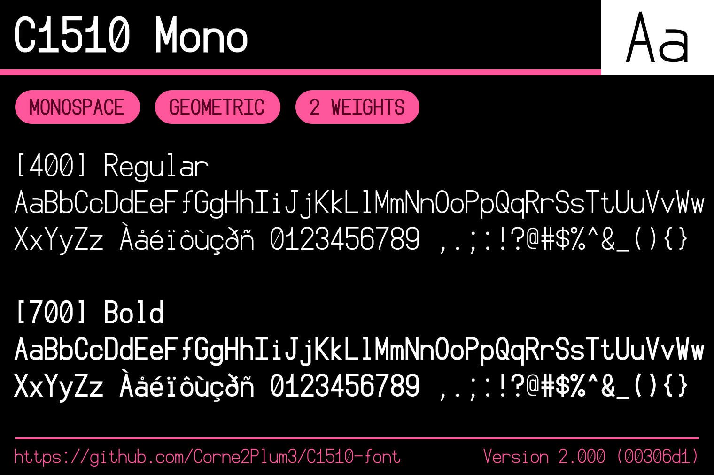
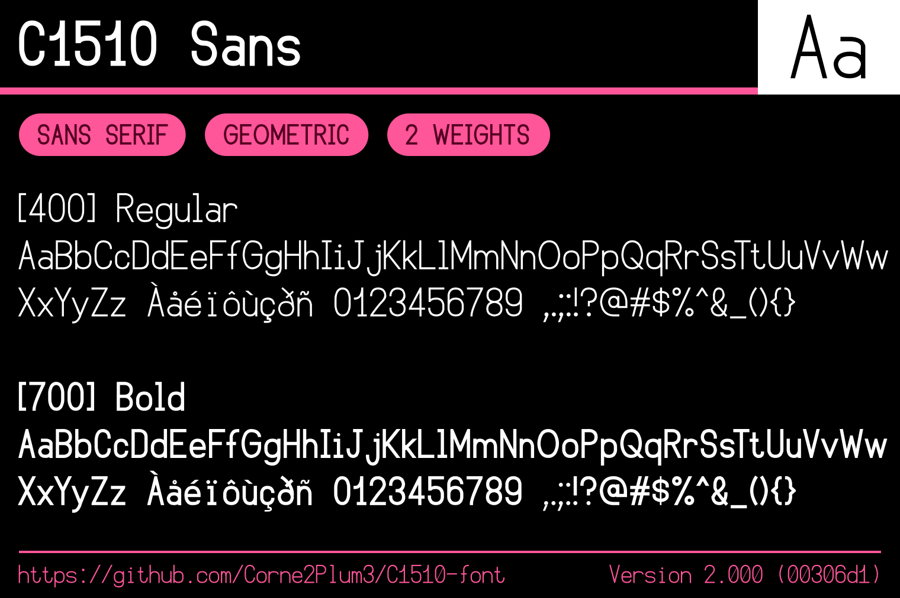
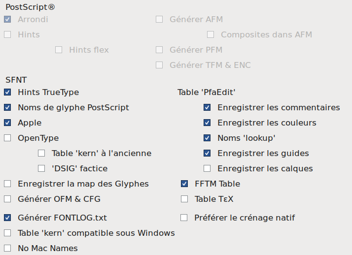

# C1510

A old font I made in **2019** using [FontArk](https://typography.guru/directory/app/fontark-defunct-r109/) (now dead). This is my first sans serif font I ever created. The font include a monospaced variant, and 2 weights.

## History

I worked on this font during summer break 2019, where I wanted to make my own font, primarily for myself. By looking for free tools (and if possible not too hard to use), I eventually started using [FontArk](https://typography.guru/directory/app/fontark-defunct-r109/). I started with the monospaced version of the font, because I wanted a font for programming at first. I added enough glyphs to support french language (I'm from France lol). This took several days. Then, from the monospaced version, I decided to make a sans serif version so the font could be used to display long texts too. This wasn't very hard. Fun fact: the Bold version was created first, and should have been the "Regular" weight. The thinner version was done by reducing the stroke width of all glyphs. As FontArk is dead, I have no way of adding new weights...

7 years later, in August 2026, I found the font as well as other abandoned font projects, and seeing that _C1510_ I don't know why the font is called like that...) is not published anywhere, I decided to rework the font a bit so it's ready for release. Some huge design issues got fixed, although the outlines still have a lot of defaults, added a kerning table for the _Sans_ variant, and hinting for all fonts, using [FontForge](https://fontforge.org/en-US/). I also fixed the naming of the font so there are 2 font families with a Regular and Bold version. Releasing the font publicly makes me think that even if the font isn't that good, this wasn't done for nothing.

I don't plan to continue working on the font, I think the best should be starting from scratch...

## Project structure

* `fonts/`: contains the font binaries
* `img/`: contains images for documentation
* `old/`: raw files from 2019 (use the fonts from `fonts/` instead)
* `sources/`: FontForge sources of the font after the 2026 revival

## Building the fonts/images

### Building the font

With FontForge, open the `.sfd` files, then export the font as TTF with the following options _(too lazy too translate to english)_:

> [!CAUTION]
> Using the October 2025 version of FontForge generates corrupted TTF files. To be able to generate the font binaries, I had to downgrade to the **January 2023** version. This is the version

### Updating the preview images

> [!NOTE]
> The image previews are based on my font [Giphurs](https://github.com/Corne2Plum3/Giphurs).

> [!WARNING]
> This should be done on a commit with no other changes, and right after modifying the font binaries.

1. Open the SVG files inside the `img/` director with a SVG editor (I'm using [Inkscape](https://inkscape.org/)).
2. Edit the version and commit number at the bottom. Use the 7 first characters from the latest _git_ commit number (you can see it with `git log`).
3. Export the images as PNG inside `img/`.

## License

This font is released under the [SIL Open Font License, Version 1.1](https://scripts.sil.org/OFL).
